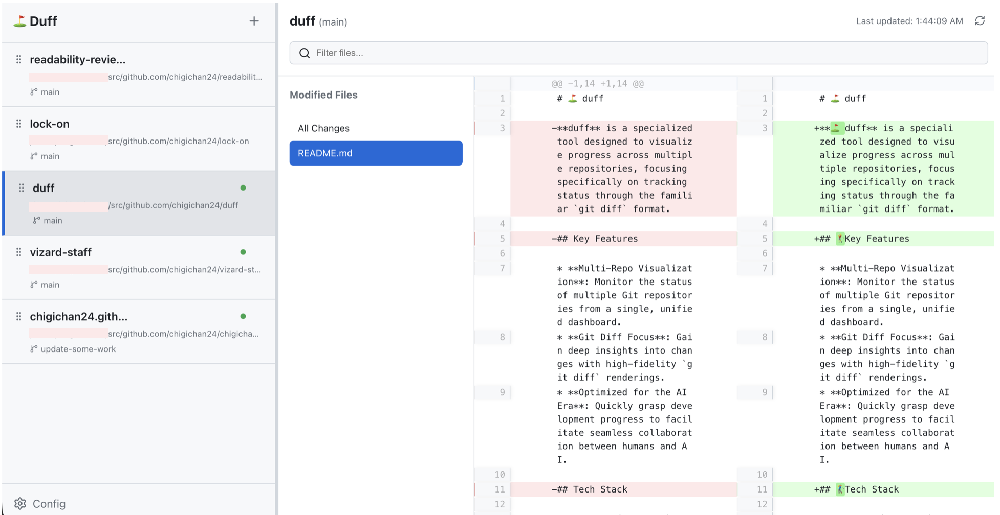

# ⛳️ duff

<!-- coverage-badge --><!-- /coverage-badge -->

**⛳️ duff** is a specialized tool designed to visualize progress across multiple repositories, focusing specifically on tracking status through the familiar `git diff` format.



## 🏌️‍♀️Key Features

* **Multi-Repo Visualization**: Monitor the status of multiple Git repositories from a single, unified dashboard.
* **Git Diff Focus**: Gain deep insights into changes with high-fidelity `git diff` renderings.
* **Optimized for the AI Era**: Quickly grasp development progress to facilitate seamless collaboration between humans and AI.

## 🏌️‍♂️Tech Stack

### Client (Frontend)
* **Framework**: [React 19](https://react.dev/)
* **Build Tool**: [Vite](https://vitejs.dev/)
* **Language**: [TypeScript](https://www.typescriptlang.org/)
* **Key Libraries**:
    * `react-diff-view` / `diff2html`: Advanced diff rendering.
    * `@hello-pangea/dnd`: Intuitive drag-and-drop interface.
    * `lucide-react`: Modern icon set.

### Server (Backend)
* **Runtime**: [Node.js](https://nodejs.org/)
* **Framework**: [Express](https://expressjs.com/)
* **Language**: [TypeScript](https://www.typescriptlang.org/)
* **Key Libraries**:
    * `simple-git`: Simplified Git command abstraction.
    * `cors` & `dotenv`: Security and environment management.

## ☄️Getting Started

### 1. Clone the Repository
```bash
git clone git@github.com:chigichan24/duff.git
cd duff
```

### 2. Install Dependencies
Install the required packages in the root, client, and server directories.
```bash
# Install root dependencies (e.g., concurrently)
npm install
```

### 3. Start the Development Server
Run the following command in the root directory to launch both the frontend and backend simultaneously:
```bash
npm run dev
```

## Project Structure
```text
.
├── client/          # Frontend (React + Vite)
├── server/          # Backend (Express)
├── package.json     # Monorepo management
└── history.log      # Update history
```

### License
MIT