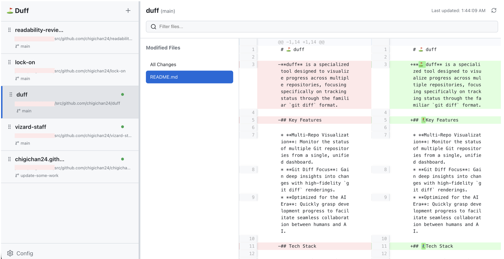
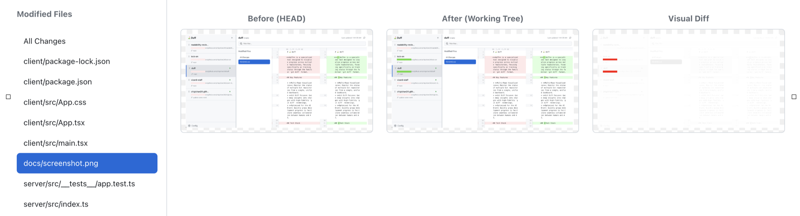

# ⛳️ duff


**⛳️ duff** is a specialized tool designed to visualize progress across multiple repositories, focusing specifically on tracking status through the familiar `git diff` format.

Runs entirely in the browser — no server required. Repositories are accessed directly via the [File System Access API](https://developer.mozilla.org/en-US/docs/Web/API/File_System_Access_API).



Visual diff is also supported.


## 🏌️‍♀️Key Features

* **Multi-Repo Visualization**: Monitor the status of multiple Git repositories from a single, unified dashboard.
* **Serverless / Browser-Only**: All Git operations run client-side using `isomorphic-git` and the File System Access API. No backend needed.
* **Git Diff Focus**: Gain deep insights into changes with high-fidelity `git diff` renderings.
* **Interactive History Graph**: Visualize commit history and stashes with an intuitive graph interface.
* **Flexible Diff Ranges**: Select and compare changes between any two points in history (commits, stashes, or the working tree).
* **Visual Image Diff**: Detect even subtle changes in images (`png`, `jpg`, `webp`, `svg`) with pixel-perfect comparison using `pixelmatch`.
* **Optimized for the AI Era**: Quickly grasp development progress to facilitate seamless collaboration between humans and AI.

## 🏌️‍♂️Tech Stack

* **Framework**: [React 19](https://react.dev/)
* **Build Tool**: [Vite](https://vitejs.dev/)
* **Language**: [TypeScript](https://www.typescriptlang.org/)
* **Key Libraries**:
    * `isomorphic-git`: Pure JavaScript Git implementation for browser-side Git operations.
    * `idb-keyval`: IndexedDB wrapper for persisting `FileSystemDirectoryHandle` across sessions.
    * `diff2html`: Advanced diff rendering.
    * `pixelmatch`: Pixel-level image comparison.
    * `@hello-pangea/dnd`: Intuitive drag-and-drop interface.
    * `lucide-react`: Modern icon set.

## ☄️Getting Started

### Requirements

* A Chromium-based browser (Chrome, Edge, Arc, etc.) with [File System Access API](https://caniuse.com/native-filesystem-api) support.
* Node.js 20+ (for development)

### 1. Clone the Repository
```bash
git clone git@github.com:chigichan24/duff.git
cd duff
```

### 2. Install Dependencies
```bash
# Install root dependencies (Playwright etc.)
npm install

# Install client dependencies
cd client
npm install
cd ..
```

### 3. Start the Development Server
```bash
npm run dev
```

Click "Add your first repository" to select a local Git repository.

### 4. Run E2E Tests
```bash
npx playwright install chromium
npx playwright test
```

## Project Structure
```text
.
├── client/          # Frontend (React + Vite + isomorphic-git)
│   └── src/
│       ├── lib/
│       │   ├── fsaAdapter.ts   # File System Access API → Node.js fs adapter
│       │   ├── gitService.ts   # Git operations abstraction (status, log, diff)
│       │   └── repoStore.ts    # Repository metadata persistence (localStorage + IndexedDB)
│       └── components/
│           └── GitGraph.tsx     # Commit history graph
├── e2e/             # Playwright E2E tests
├── package.json     # Root scripts (dev, test:e2e)
└── playwright.config.ts
```

### License
MIT
